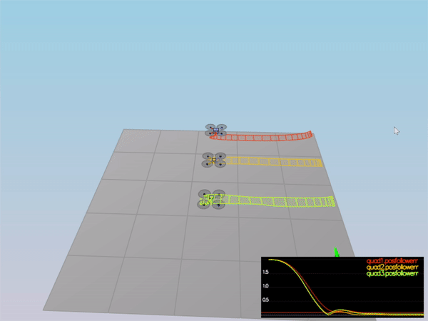
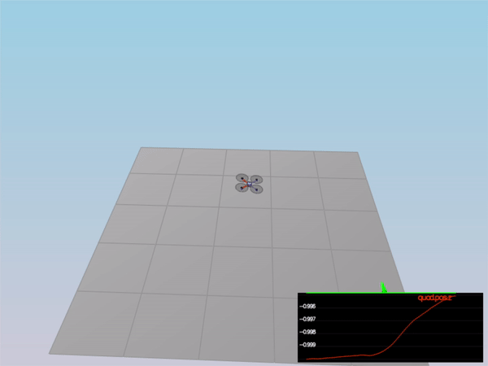
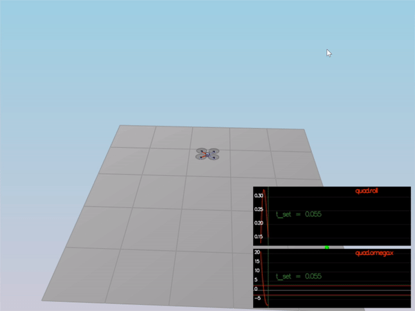
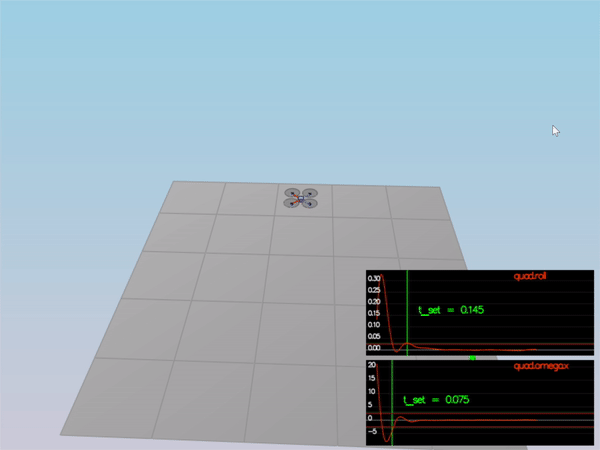

# Control A 3D Quadrotor #

## Video Demonstration

## Overview

In this project, a cascaded controller is implemented to control the quadrotors to follow some trajectories. 5 different scenes were tested in the simulation.

## Build Instruction

Please refer to **Development Environment Setup** section of [FCND-Controls-CPP](https://github.com/udacity/FCND-Controls-CPP) to set up the simulation. To learn more about how the simulator works, please refer to the **Simulator Walkthrough** section of the same repository.

## Project Detail ##

#### Intro (scenario 1)

Tune the `Mass` parameter in `QuadControlParams.txt` to make the vehicle more or less stay in the same spot in the first scenario. With proper mass, the drone should be like

#### Body rat and roll/pitch control (scenario 2) ####

The controller needs to stabilize the rotational motion and bring the vehicle back to level attitude. Tune `kpPQR` in `QuadControlParams.txt` to get the vehicle to stop spinning quickly but not overshoot. Tune `kpBank` in `QuadControlParams.txt` to minimize settling time but avoid too much overshoot

#### Position/velocity and yaw angle control (scenario 3) ####

`Scenario 3` will create 2 identical quads, one offset from its target point (but initialized with yaw = 0) and second offset from target point but yaw = 45 degrees. Tune parameters `kpPosZ`, `kpPosZ`, `kpVelXY` and `kpVelZ` to navigate the quads to their destination points and decrease tracking error. Tune parameters `kpYaw` and the 3rd (z) component of `kpPQR` to control yaw.

#### Non-idealities and robustness (scenario 4) ####

`Scenario 4` is a configuration with 3 quads that are all are trying to move one meter forward.  However, this time, these quads are all a bit different:

 - The green quad has its center of mass shifted back
 - The orange vehicle is an ideal quad
 - The red vehicle is heavier than usual

Tune the altitude integral control, lateral control and other control parameters until all the quads successfully move properly.

#### Tracking trajectories (scenario 5) ####

`Scenario 5 ` has two quadcopters:

 - the orange one is following `traj/FigureEight.txt`, which only contains position information.
 - the other one is following `traj/FigureEightFF.txt`, which contains both position and velocity information.

#### The final controller parameters

| Controller Parameters | Value       |
| --------------------- | ----------- |
| kpPosXY               | 40          |
| kpPosZ                | 30          |
| KiPosZ                | 40          |
| kpVelXY               | 15          |
| kpVelZ                | 12          |
| kpBank                | 10          |
| kpYaw                 | 2.5         |
| kpPQR                 | (70, 70, 7) |

## Special Thanks ##

Thanks to Fotokite for the initial development of the project code and simulator.