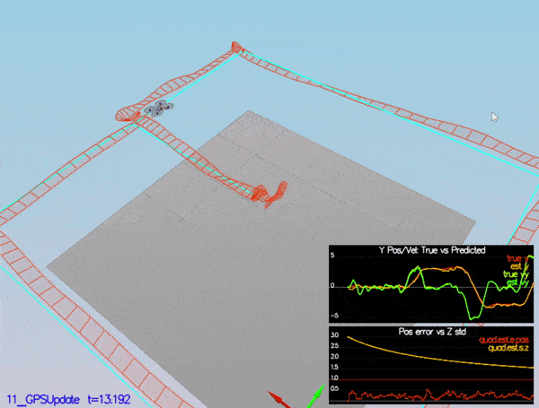
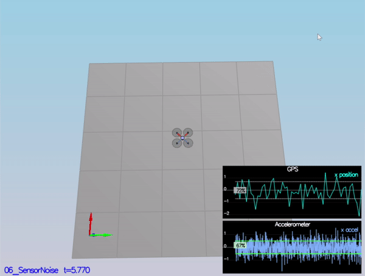
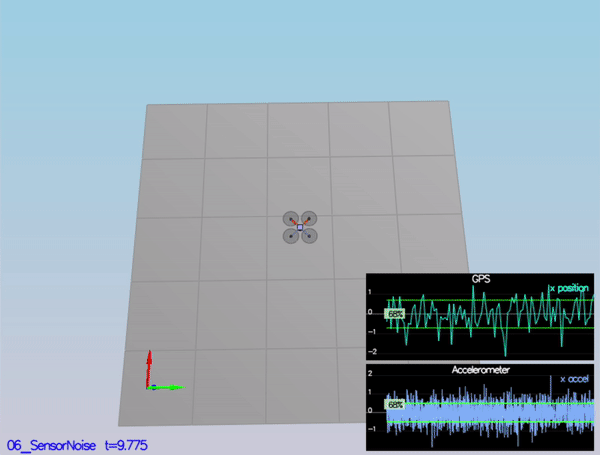
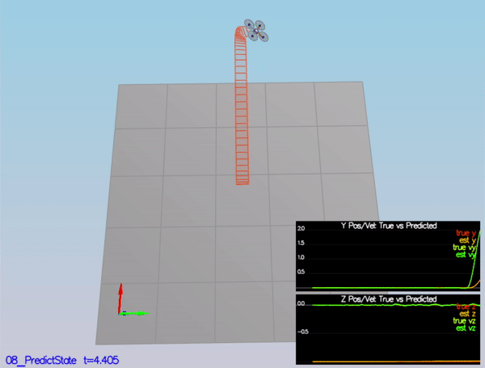
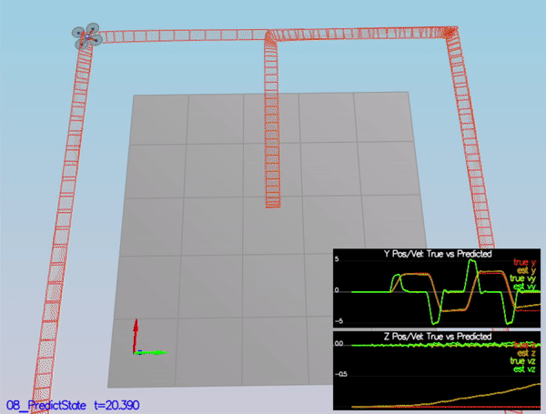
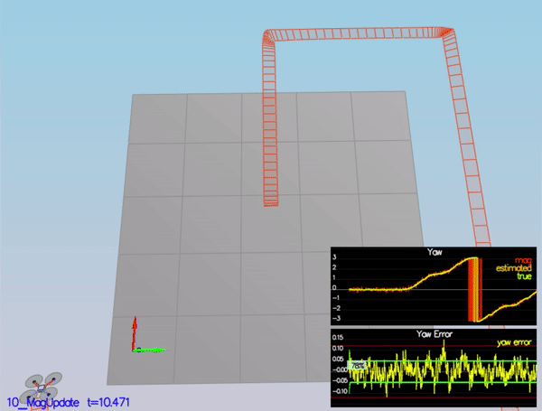

# Estimation #

## Video Demonstration

## Overview

In this project, the estimation portion of the controller used in the simulator is developed. The simulated quadrotor is flying with the estimator and controller from the last project. 

## Build Instruction

Please refer to **Development Environment Setup** section of [FCND-Controls-CPP](https://github.com/udacity/FCND-Controls-CPP) to set up the simulation. To learn more about how the simulator works in this project, please refer to the **Setup** section of [FCND-Estimation-CPP](https://github.com/udacity/FCND-Estimation-CPP.git).

## Project Detail ##

#### Sensor Noise (scenario 6)

The standard deviations of the the GPS X signal and the IMU Accelerometer X signal are initially set to arbitrary values. After setting them to correct values in `config/6_Sensornoise.txt`, one should see ~68% of the measurement points fall into the +/- 1 sigma bound.

#### Attitude Estimation (scenario 7)

For this simulation, the only sensor used is the IMU and noise levels are set to 0. After improving the complementary filter-type attitude filter with a better rate gyro attitude integration scheme. One should be able to see the attitude errors to get within 0.1 rad for each of the Euler angles, as shown in the below.

#### Prediction Step (scenario 8)

This scenario is configured to use a perfect IMU (only an IMU). One should see the estimator state track the actual state, with only reasonably slow drift, as shown in the figure below.

#### Predict Covariance (scenario 9)

This scene introduces a realistic IMU, one with noise.  Tune the `QPosXYStd` and the `QVelXYStd` process parameters in `QuadEstimatorEKF.txt` and capture the magnitude of the error. The result is shown below.

#### Magnetometer Update (scenario 10)

Tune the parameter `QYawStd` (`QuadEstimatorEKF.txt`) for the `QuadEstimatorEKF` so that it approximately captures the magnitude of the drift, as demonstrated here:

#### Closed Loop + GPS Update  (scenario 11)

At the moment this scenario is using both an realistic estimator and IMU. Tune the process noise model in `QuadEstimatorEKF.txt`. The quadrotor is able to complete the entire simulation cycle with estimated position error of < 1m.

#### Final EKF parameters

| EKF Parameters | Value |
| -------------- | ----- |
| QPosXYStd      | 0.5   |
| QPosZStd       | 0.05  |
| QVelXYStd      | 0.1   |
| QVelZStd       | 0.1   |
| QYawStd        | 0.25  |
| GPSPosXYStd    | 1.0   |
| GPSPosZStd     | 20    |
| GPSVelXYStd    | 0.1   |
| GPSVelZStd     | 0.5   |
| MagYawStd      | 0.1   |
| attitudeTau    | 100   |

#### Adding controller from last project ####

Use the cascaded controller from last project and retune the parameters to fit the estimator.

| Controller Parameters | Value       |
| --------------------- | ----------- |
| kpPosXY               | 2.5         |
| kpPosZ                | 5           |
| KiPosZ                | 10          |
| kpVelXY               | 10          |
| kpVelZ                | 20          |
| kpBank                | 10          |
| kpYaw                 | 2           |
| kpPQR                 | (70, 70, 9) |

## Special Thanks ##

Thanks to Fotokite for the initial development of the project code and simulator.